<td>

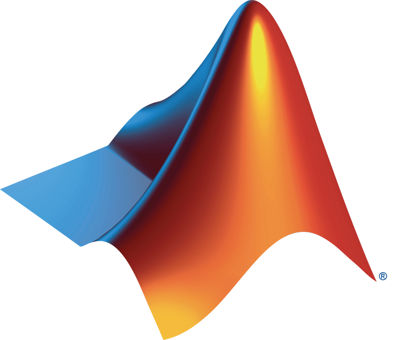

</td>

# MATLAB and Simulink for Students :school: :books: :computer:  

Are you a new MATLAB user seeking helpful tips and tricks? Are you a member of a student society in search of engaging workshops? Or perhaps you're looking for opportunities to test your MATLAB skills through student competitions or challenges? Look no further! Our awesome list repository below is a resource that caters to all these needs. Whether you're starting from scratch or aiming to enhance your existing knowledge, you'll find a wealth of information to help you learn MATLAB and make progress on your journey as a student. Explore the repository now and unlock the potential of MATLAB! Follow us on Instagram for more student resources, events, and competitions! @matlab_students 📸

## Table of Contents

- [New to MATLAB? Start here!](#new-to-matlab-start-here-computer-bulb)
  - [Self-Paced Onramps](#self-paced-onramps)
  - [Cheat Sheets](#cheat-sheets-blue_book-pencil2)
- [Academic Discipline Specific Resources](#industrydiscipline-specific-resources-airplane-racing_car-robot-microscope)
- [Student Programs and Competitions](#student-programs-trophy)
  - [Hackathons and Capstone Projects](#related-matlab-github-resources-for-students)
  - [Student Societies and Clubs](#resources-for-student-societies-and-student-clubs)
  - [Interactive Examples and Fun Animations](#interactive-and-fun-matlab-examples)
- [What's New in MATLAB and Simulink](#whats-new-in-matlab-and-simulink)
  - [Use MATLAB with AI](#how-to-use-matlab-with-ai-robot)
- [Student Career Opportunities](#student-career-opportunities-briefcase)
- [Student License for MATLAB](#need-a-student-license-of-matlab)
- [Need Support or Help?](#where-to-go-to-get-help)

## New to MATLAB? Start here! :computer: :bulb:

Check out this section to explore what MATLAB is, how it is utilized in education and industry, and how it can benefit engineers and scientists globally.

<table>
<tbody>

<tr class="odd">
<td> <b>What is MATLAB and Simulink?<b>  
</td>
<td><ul>
Why is MATLAB important, and how is it used? 
<li><a href="https://www.youtube.com/watch?v=joilU9m-sNk">MATLAB Overview</a></li>
<li><a href="https://www.mathworks.com/videos/getting-started-with-matlab-68985.html">Getting Started with MATLAB - 10 Minute Tutorial </a></li>
<li><a href="https://www.youtube.com/watch?v=xkImXFzYDv4">MATLAB Basics: Back to School Edition </a></li>
<li><a href="https://www.mathworks.com/help/matlab/getting-started-with-matlab.html">Get Started with MATLAB Documentation</a></li>
<li><a href="https://www.mathworks.com/company/user_stories/designed-with-matlab.html">How will you use MATLAB?</a></li>
 
What is Simulink? 
<li><a href="https://www.youtube.com/watch?v=GvRugdEICyQ">Simulink Overview</a></li>
<li><a href="https://www.mathworks.com/videos/getting-started-with-simulink-69027.html">Getting Started with Simulink - 11 Minute Tutorial</a></li>
<li><a href="https://www.mathworks.com/help/simulink/getting-started-with-simulink.html">Get Started with Simulink Documentation</a></li>
 
<a href="https://www.mathworks.com/help/?s_tid=gn_supp">Full MATLAB & Simulink Documentation</a>
 
 
Check to see if your school has a campus-wide license:
<li><a href="https://www.mathworks.com/products/matlab/student.html">Get MATLAB</a></li>
</ul></td>
  
<tr class="odd">
<td> <b>Getting Started Onramps<b>  

 </td>
<td><ul>
Primary or Secondary School students start here:
<li><a href="https://learntocode.mathworks.com/">Learn to Code</a></li>
 
University and College Students Start Here:
 
Complimentary 2-hour MATLAB tutorials for 
<li><a href="https://matlabacademy.mathworks.com/details/matlab-onramp/gettingstarted">MATLAB</a></li>
<li><a href="https://matlabacademy.mathworks.com/details/machine-learning-onramp/machinelearning">Machine Learning</a></li>
<li><a href="https://matlabacademy.mathworks.com/details/deep-learning-onramp/deeplearning">Deep Learning</a></li>
<li><a href="https://matlabacademy.mathworks.com/details/reinforcement-learning-onramp/reinforcementlearning">Reinforcement Learning</a></li>
<li><a href="https://matlabacademy.mathworks.com/details/optimization-onramp/optim">Optimization</a></li>
<li><a href="https://matlabacademy.mathworks.com/details/signal-processing-onramp/signalprocessing">Signal Processing</a></li>
<li><a href="https://matlabacademy.mathworks.com/details/image-processing-onramp/imageprocessing">Image Processing</a></li>
 
Complimentary 2-hour Simulink tutorials for
<li><a href="https://matlabacademy.mathworks.com/details/simulink-onramp/simulink">Simulink</a></li>
<li><a href="https://matlabacademy.mathworks.com/details/stateflow-onramp/stateflow">Stateflow</a></li>
<li><a href="https://matlabacademy.mathworks.com/details/control-design-onramp-with-simulink/controls">Control Design</a></li>
<li><a href="https://matlabacademy.mathworks.com/details/simscape-onramp/simscape">Simscape</a></li>
<li><a href="https://matlabacademy.mathworks.com/details/circuit-simulation-onramp/circuits">Circuit Simulation</a></li>
</ul></td>
</tr>

<tr class="odd">
<td> <b>MATLAB Cheat Sheets<b>  

[<a href="CheatSheets">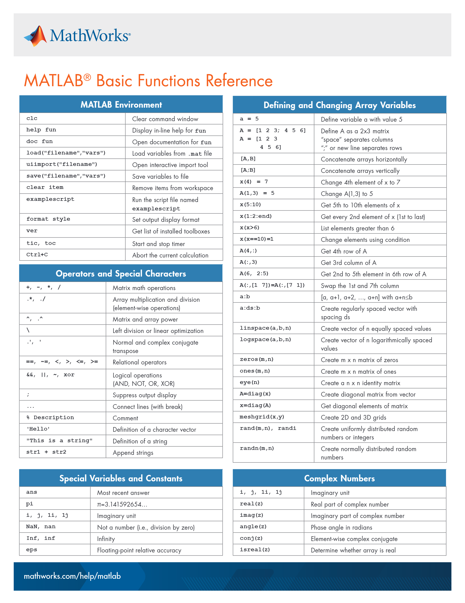</a>](CheatSheets)

<td><ul>

Check out our Cheat Sheet Repository to help you learn the following topics
- [MATLAB Basic Functions](https://github.com/mathworks/awesome-matlab-students/blob/main/CheatSheets/matlab-basic-functions-reference.pdf) 
- [Visualization](https://github.com/mathworks/awesome-matlab-students/blob/main/CheatSheets/MATLAB_Visualization_Reference_EN.pdf)
- [Importing data](https://github.com/mathworks/awesome-matlab-students/blob/main/CheatSheets/importing-exporting-data-cheat-sheet.pdf)
- [Deep Learning](https://github.com/mathworks/awesome-matlab-students/blob/main/CheatSheets/deep-learning-with-matlab-quick-start-guide.pdf)
- [Using MATLAB with Python](https://github.com/mathworks/awesome-matlab-students/blob/main/CheatSheets/using-matlab-with-python-cheat-sheet.pdf)
- [Machine Learning](https://github.com/mathworks/awesome-matlab-students/blob/main/CheatSheets/machine-learning-quick-start-guide.pdf)
- [MATLAB for Python Users](https://github.com/mathworks/awesome-matlab-students/blob/main/CheatSheets/matlab-for-python-users-cheat-sheet.pdf)
- [Live Editor](https://github.com/mathworks/awesome-matlab-students/blob/main/CheatSheets/live-editor-quick-start-guide.pdf)
- and more!
 

[All Cheat Sheets](https://github.com/mathworks/awesome-matlab-students/tree/main/CheatSheets)
  
</ul></td>

<tr class="odd">
<td> <b>MATLAB's YouTube How-To Playlist<b>  
</td>
<td><ul>
Short videos from MathWorks’ engineers on how to solve some of the most common tasks for your project
<li><a href="https://www.youtube.com/playlist?list=PLn8PRpmsu08oBSjfGe8WIMN-2_rwWFSgr">Watch the Videos</a></li>
</ul></td>
</tr>

<tr class="odd">
<td> <b> MATLAB and Simulink examples for Students</a></b>
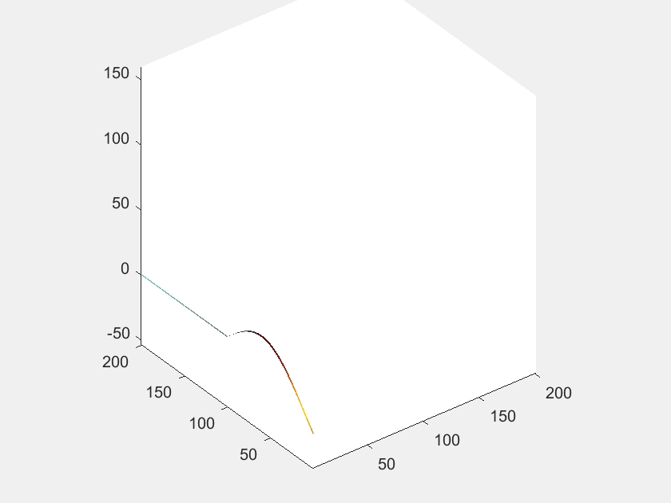 </td>
<td><ul>
Learn How to Use MATLAB and Simulink
<li><a href="https://www.mathworks.com/academia/examples.html?s_tid=ln_acad_learn_examples">MATLAB and Simulink examples</a></li>
<li><a href="https://www.mathworks.com/support/learn-with-matlab-tutorials.html?s_tid=ln_acad_learn_tutorials">MATLAB and Simulink Tutorials</a></li>
<li><a href="https://www.mathworks.com/matlabcentral/cody/?s_tid=ln_acad_learn_cody">Practice Coding with Cody</a></li>
</ul></td>
</tr>
 
<tr class="odd">
<td> <b>Student Lounge Blog<b>  
</td>
<td><ul>
Sharing technical and real-life examples of how students can use MATLAB and Simulink in their everyday projects #studentsuccess
<li><a href="https://blogs.mathworks.com/student-lounge/category/data-science/?s_tid=Blog_student-lounge_Category">Data Science</a></li>
<li><a href="https://blogs.mathworks.com/student-lounge/category/workflow/?s_tid=Blog_student-lounge_Category">Project Workflows</a></li>
<li><a href="https://blogs.mathworks.com/student-lounge/category/skills/?s_tid=Blog_student-lounge_Category">Improve your skills</a></li>
<li><a href="https://blogs.mathworks.com/student-lounge/category/automated-driving/?s_tid=Blog_student-lounge_Category">Automated Driving</a></li>
<li><a href="https://blogs.mathworks.com/student-lounge/">All Student Lounge Blogs</a></li>
</ul></td>
</tr>

<tr class="odd">
<td> <b>MATLAB Central's File Exchange<b>  
  
 </td>
<td><ul>
Download and use community-contributed code to help you get started or gain inspiration for your project
<li><a href="https://www.mathworks.com/matlabcentral/fileexchange/?s_tid=gn_mlc_fx_files">Find Code to inspire your project</a></li>
<li><a href="https://www.mathworks.com/matlabcentral/fileexchange/?category%5B%5D=support%2Fgaming800">Need a Study Break? Download a game on File Exchange</a></li>
<ul>
<li>Matt Fig (2023). MATLABTETRIS (https://www.mathworks.com/matlabcentral/fileexchange/34513-matlabtetris), MATLAB Central File Exchange. Retrieved July 20, 2023.</li>     
</ul>
</ul></td>
</tr>

<tr class="odd">
<td> <b>MATLAB Answers<b>  

<td><ul>
Find Answers, Learn, and Share Your Knowledge
<li><a href="https://www.mathworks.com/matlabcentral/answers/index/?s_tid=gn_mlc_an">Learn from the Community</a></li>
</ul></td>
</tr>

</tr>
<tr class="odd">
<td> <b> Videos and Tutorials for Student Projects <b>  

<td><ul>
Learn How to Use MATLAB and Simulink for Student Projects
<li><a href="https://www.mathworks.com/academia/student-competitions/resources/auto-drive.html">ADAS</a></li>
<li><a href="https://www.mathworks.com/academia/student-competitions/resources/internal-combustion-engines.html">Internal Combustion Engines</a></li>
<li><a href="http://mathworks.com/academia/student-competitions/resources/wireless-communications.html">Wireless Communications</a></li>
<li><a href="https://www.mathworks.com/academia/student-competitions/resources/electric-vehicles.html">Electric Vehicles</a></li>
<li><a href="https://www.mathworks.com/academia/student-competitions/resources/aerospace.html">Aerospace</a></li>
<li><a href="https://www.mathworks.com/academia/student-competitions/resources/robotics.html">Robotics</a></li>
<li><a href="https://www.mathworks.com/academia/student-competitions/resources/mathematics.html">Mathematics</a></li>
<li><a href="https://www.mathworks.com/academia/student-competitions/resources.html">All Student Project Tutorials</a></li>
</ul></td>
</tr>

<tr class="odd">
<td> <b> Try MATLAB Online or MATLAB Mobile <b>  
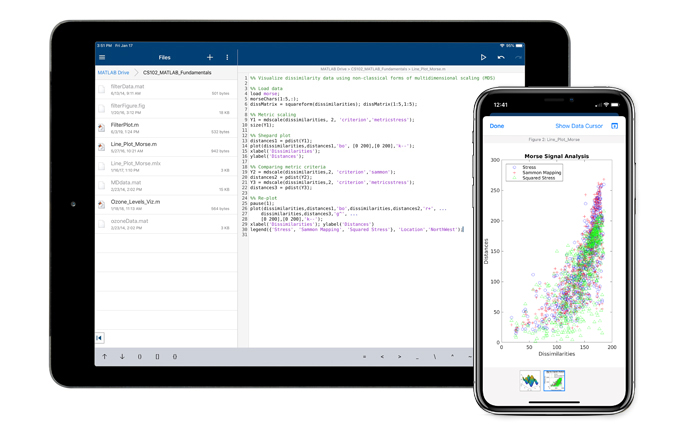
<td><ul>

<li><a href="https://www.mathworks.com/products/matlab-mobile.html">Access MATLAB on the go! </a> Learn how to collect data and use MATLAB right from your smartphone </li>
<li><a href="https://www.mathworks.com/products/matlab-online.html">Access MATLAB on the web, no download required </a></li>

</ul></td>
</tr>

<tr class="odd">
<td> <b> Connect to Hardware using MATLAB <b>  
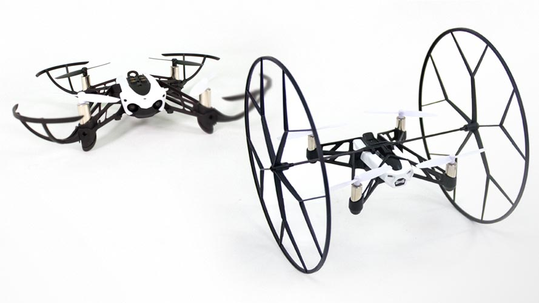
<td><ul>

<li><a href="https://www.mathworks.com/hardware-support/home.html">All Hardware Support</a></li>
<li><a href="https://www.mathworks.com/hardware-support/arduino-matlab.html?s_tid=srchtitle">Arduino® Support</a></li>
<li><a href="https://www.mathworks.com/hardware-support/raspberry-pi-matlab.html?s_tid=srchtitle">Raspberry Pi™ Support</a></li>
<li><a href="https://www.youtube.com/watch?v=IwIF_2tFnVo">Use Devices with Hardware Manager</a></li>

</ul></td>
</tr>

<tr class="odd">
<td> <b> Join our MATLAB Communities and follow us on Social Media <b>  
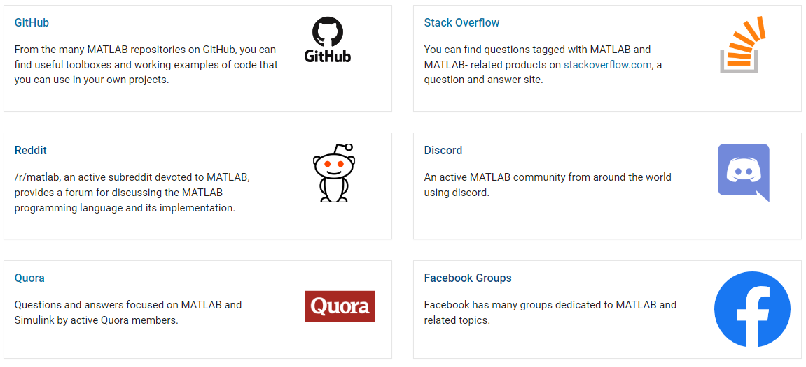
<td><ul>
Ask questions, learn from others, and get ideas by joining our communities below!
<li><a href="https://www.mathworks.com/matlabcentral/">MATLAB Central</a></li>
<li><a href="https://discord.com/invite/TsDarpu">Discord</a></li>
<li><a href="https://www.reddit.com/r/matlab/">Reddit</a></li>
<li><a href="https://www.instagram.com/matlab/">Instagram</a></li>
<li><a href="https://www.instagram.com/matlab_students/">Student Focused Instagram</a></li>
<li><a href="https://www.facebook.com/MATLAB">Facebook</a></li>

</ul></td>

</tr>

<tr class="odd">
<td> <b> Tune in to a Live Event or Webinar <b>  

<td><ul>

<li><a href="https://www.mathworks.com/company/events/search.html?s_tid=gn_ev_uw&q=&page=1">MATLAB and Simulink Live Events
 </a> </li>
<li><a href="https://www.mathworks.com/videos/search.html?s_tid=gn_ev_rw&q=&page=1">On-Demand Videos and Webinars</a></li>

</ul></td>
</tr>

<tr class="odd">
<td> <b>MATLAB and Simulink Books<b>  

<td><ul>
More than 2,000 titles available for Students! 
<li><a href="https://www.mathworks.com/academia/books.html?s_tid=ln_acad_learn_books">Explore our book list</a></li>
<li><a href="https://github.com/yanndebray/matlab-with-python-book/">New MATLAB with Python Book!</a></li>
</ul></td>
</tr>

<tr class="odd">
<td> <b>Student Programs: Explore MathWorks Student Programs  <b>  

<td><ul>
MathWorks Student Programs offers students an opportunity to participate in competitions, hackathons, and challenges, as well as access resources, project ideas, and career opportunities. 
 
 
<li><a href="https://www.mathworks.com/academia/students.html"> Explore Student Programs Here!</a></li>
</ul></td>
</tr>

<tr class="odd">
<td> <b>Participate in the 2025 Simulink Student Challenge!<b>  

<td><ul>
MathWorks celebrates the talent, creativity, and innovative spirit of students. We aim to showcase students’ innovative projects with the annual Simulink Student Challenge. In this challenge, you’ll have the opportunity to win up to $1000 (USD) by submitting a short original video that shows what you’ve accomplished using Simulink.
<li><a href="https://www.mathworks.com/academia/students/competitions/student-challenge/simulink-student-challenge.html">Join the competition! </a></li>
</ul></td>
</tr>

<tr class="odd">
<td> <b> MATLAB AI Chat Playground and ChatGPT <b>  
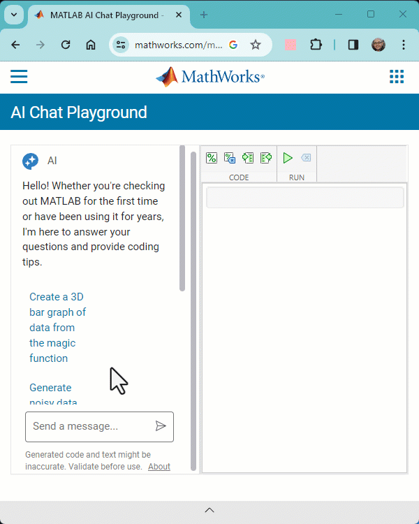
<td><ul>
Discover the future of coding with the MATLAB AI Chat Playground! Dive into Generative AI to swiftly draft code, solve intricate problems, and accelerate your MATLAB projects like never before. 
<li><a href="https://www.mathworks.com/matlabcentral/playground">The MATLAB AI Chat Playground is ready for you to experiment with Generative AI, answer questions, and write an initial draft of MATLAB® code. </a></li>
<li><a href="https://chatgpt.com/g/g-QFTjbeK3U-matlab"> MATLAB GPT is now available on the OpenAI GPT Store </a></li>
</ul></td>
</tr>

</tbody>
</table>

---
## Self-Paced Onramps
**Discover and Elevate Your Skills with MATLAB and Simulink Onramps**

[MATLAB and Simulink Onramps](https://matlabacademy.mathworks.com/?s_tid=ln_acad_learn_oc#getting-started) offer a remarkable opportunity to explore a wide range of topics according to your interests and preferred pace. These onramps are designed to be flexible, allowing you to complete them at your convenience while effectively guiding you through various learning objectives. By immersing yourself in these onramps, you can unlock the power of MATLAB and Simulink, elevating your engineering and science skills to new heights.

| Machine Learning Onramp | Deep Learning Onramp | Circuit Simulation Onramp | Reinforcement Learning Onramp |
|-------------------------|---------------------|--------------------------|------------------------------|
|  |  |  |  |

| Image Processing Onramp | Computer Vision Onramp | Signal Processing Onramp | Simscape Onramp |
|------------------------|-----------------------|-------------------------|-----------------|
|  |  |  |  |

| Stateflow Onramp | Control Design Onramp with Simulink | Optimization Onramp | App Building Onramp |
|------------------|-------------------------------------|---------------------|---------------------|
|  |  |  |  |

| MATLAB Onramp | Simulink Onramp |
|---------------|-----------------|
|  |  |

---
## Cheat Sheets :blue_book: :pencil2:

​​**Master MATLAB Functions and Commands with Featured Cheat Sheets**

Explore this section to find a collection of featured cheat sheets that provide concise references for learning MATLAB functions and commands. Whether you're a beginner or an experienced user, these cheat sheets offer valuable insights and quick reminders to enhance your MATLAB proficiency. To access our complete library of cheat sheets, visit: [Cheat Sheets](CheatSheets)

***Quick Tip! [Use Keyboard Shortcuts to Navigate MATLAB](https://www.mathworks.com/help/matlab/matlab_env/accessibility-use-keyboard-shortcuts-to-navigate-matlab.html)***

<table>
<tbody>

<tr class="odd">
<td> <b>MATLAB Basic Functions Cheat Sheet<b>  
</td>
<td><ul>
  
[MATLAB Basic Functions Cheat Sheet](CheatSheets/matlab-basic-functions-reference.pdf)
  
</ul></td>
</tr>

<tr class="odd">
<td> <b>Using MATLAB with Python Cheat Sheet<b>  
<a href="CheatSheets/using-matlab-with-python-cheat-sheet.pdf">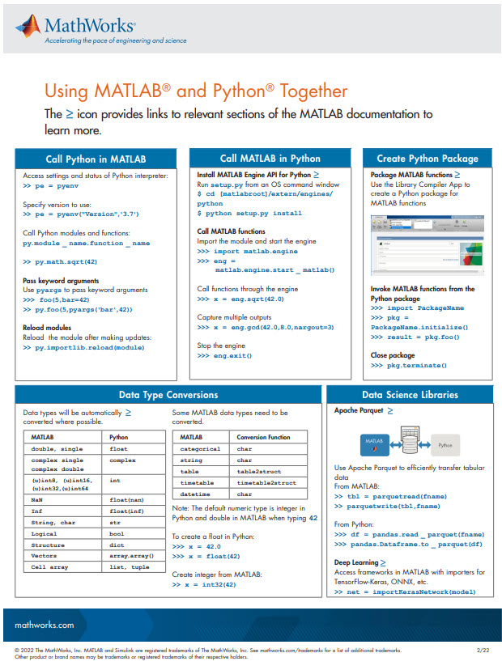</a></td>
<td><ul>
  
[Using MATLAB with Python Cheat Sheet](CheatSheets/using-matlab-with-python-cheat-sheet.pdf)
 
 
[MATLAB for Python Users](CheatSheets/matlab-for-python-users-cheat-sheet.pdf)
 
 
[Using Simulink with Python](https://www.mathworks.com/help/simulink/python-code-integration.html)
 
 
[MATLAB and Python Resource Page](https://www.mathworks.com/products/matlab/getting-started/using-matlab-python.html)

</ul></td>
</tr>

<tr class="odd">
<td> <b> Machine Learning with MATLAB Cheat Sheet<b>  
<a href="CheatSheets/machine-learning-quick-start-guide.pdf">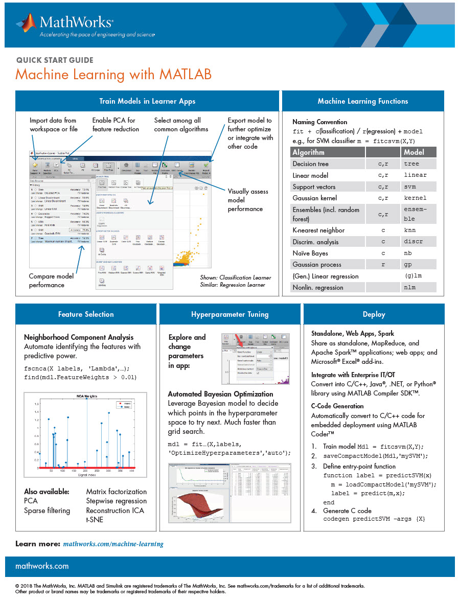</a></td>
<td><ul>
  
[Machine Learning with MATLAB](CheatSheets/machine-learning-quick-start-guide.pdf)

</ul></td>
</tr>

<tr class="odd">
<td> <b> MATLAB Visualization Cheat Sheet<b>  
<a href="CheatSheets/MATLAB_Visualization_Reference_EN.pdf">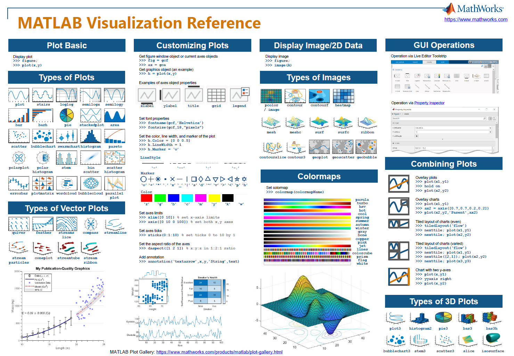</a></td>
<td><ul>
  
[MATLAB Visualization Cheat Sheet](CheatSheets/MATLAB_Visualization_Reference_EN.pdf) 
 
 
[Check out the MATLAB Plot Gallery for more examples](https://www.mathworks.com/products/matlab/plot-gallery.html)
</ul></td>
</tr>

<tr class="odd">
<td> <b> Modeling Dynamic Systems with MATLAB and Simulink Cheat Sheet <b>  
<a href="CheatSheets/modeling-dynamic-systems-cheat-sheet.png">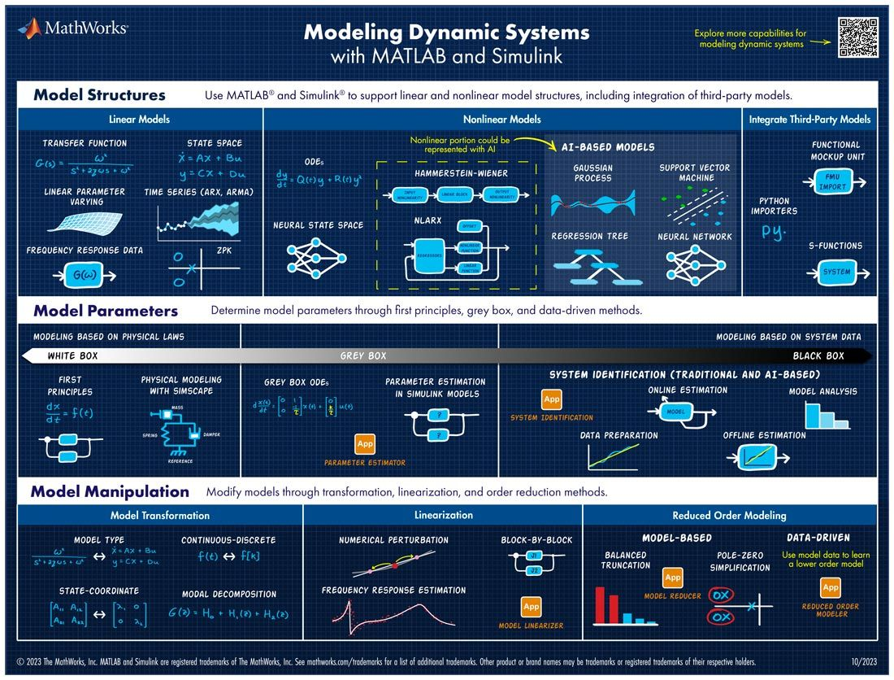</a></td>
<td><ul>
  
[Modeling Dynamic Systems Cheat Sheet](CheatSheets/modeling-dynamic-systems-cheat-sheet.png) 
 
 
[Explore more capabilities for modeling dynamic systems here](https://www.mathworks.com/solutions/control-systems/modeling-dynamic-systems.html?s_eid=PSM_17435)

</ul></td>
</tr>

<tr class="odd">
<td> <b> Capabilities for Designing Feedback Control Systems <b>  
</td>
<td><ul>
  
[Capabilities for Designing Feedback Control Systems](CheatSheets/feedback-control-design-cheat-sheet.png) 
 
 
[Explore more capabilities for designing and tuning controllers here](https://www.mathworks.com/solutions/control-systems/feedback-control-systems.html)

</ul></td>
</tr>

</tbody>
</table>

---
## Industry/Discipline-Specific Resources :airplane: :racing_car: :robot: :microscope:

**Explore Additional Resources for Your Academic Discipline or Industry**

Click on the icon in the table below to access a wealth of additional resources tailored to your academic discipline or Industry. This is only a short list and to explore all resources, go to the General Resources section below and select "All Resources". Also, see how MATLAB & Simulink are used in the Industry by reading one of our [customer stories](https://www.mathworks.com/company/customer-stories.html).

## Industry & Application

| Aerospace & Defense | Utilities & Energy | Automotive | Robotics | Industrial Automation | Communications |
|:---:|:---:|:---:|:---:|:---:|:---:|
|  |  |  |  |  |  |

| Medical Devices | Biotech and Pharma | Finance | Semiconductors | Electronics | Artificial Intelligence |
|:---:|:---:|:---:|:---:|:---:|:---:|
|  |  |  |  |  |  |

## Academic Discipline

| Physics | Chemistry | Mathematics | Neuroscience | Mechanical Engineering |
|:---:|:---:|:---:|:---:|:---:|
|  |  |  |  |  |

| Biological Sciences | Electrical Engineering | Chemical Engineering | Geoscience |
|:---:|:---:|:---:|:---:|
|  |  |  |  |

## General Resources

| All Discipline and Industry Specific Resources | Application Specific Support | External Language Interfaces |
|:---:|:---:|:---:|
|  |  |  |

#### Additional Resources:
- [MATLAB and Simulink Webinars/Videos](https://www.mathworks.com/videos.html)
- Additional Online Courses with [edX](https://www.edx.org/school/mathworks) and [COURSERA!](https://www.coursera.org/mathworks)
- [Industry User Stories](https://www.mathworks.com/company/user_stories/search.html?q=&page=1)
- [External Language Interfaces](https://www.mathworks.com/help/matlab/external-language-interfaces.html)
- [Interactive Discipline Specific Examples](https://www.mathworks.com/matlabcentral/fileexchange/?term=tag:%22courseware+module%22)

---

## Student Programs :trophy:
**Explore Exciting Student Competitions, Hackathons, and Minidrone Contests!**

Unleash your creativity and passion by discovering a world of student competitions, hackathons, mini drone contests, and more! This is your chance to showcase your skills, collaborate with like-minded individuals, and tackle real-world challenges. Don't miss out on the thrilling opportunities that await you! Explore them all [right here!](https://www.mathworks.com/academia/students.html?s_tid=ln_acad_programs_overview)

  <kbd>
    
  </kbd>

---
## Related MATLAB GitHub Resources for Students

Looking for even more MATLAB & Simulink resources on GitHub? Then explore these curated resources to **enhance your skills**, **tackle real-world challenges**, and **connect with the MATLAB community**.

---

### Highlighted Repositories to Explore

- [Challenge Projects](#-matlab--simulink-challenge-projects)
- [Hackathons](#-awesome-matlab-hackathons)
- [Robotics](#-awesome-matlab--simulink-robotics)
- [Deep Learning](#-deep-learning-resources-for-matlab--simulink)
- [UAV](#-uav-with-matlab-and-simulink-resources)
- [Renewable Energy](#-renewable-energy-with-matlab-and-simulink-resources)

---

### 🏆 MATLAB & Simulink Challenge Projects
*Looking for a capstone design project or to contribute to solving industry challenges? Check out our challenge projects below!*

- Stay up-to-date with technology trends
- Gain hands-on MATLAB & Simulink skills
- Earn official recognition and rewards  
👉 [Explore Challenge Projects](https://github.com/mathworks/MathWorks-Excellence-in-Innovation)

---

### 🎉 Awesome MATLAB Hackathons
*Join a sponsored hackathon!*

- Discover upcoming events
- Compete for prizes and recognition  
👉 [See Hackathons](https://github.com/mathworks/awesome-matlab-hackathons)

---

### 🤖 Awesome MATLAB & Simulink Robotics
*Robotics community resources*

- Demos, tutorials, and utilities for robotics
- For all skill levels  
👉 [Browse Robotics Resources](https://github.com/mathworks-robotics/awesome-matlab-robotics)

---

### 🧠 Deep Learning Resources for MATLAB & Simulink
*AI community resources*

- Demos, tutorials, and models for AI
- Community-driven content  
👉 [Access Deep Learning Resources](https://github.com/matlab-deep-learning)

---

### 🛩 UAV With MATLAB and Simulink Resources
*Unmanned Aerial Vehicle (UAV) projects and tools*

- Design, simulate, and control UAVs
- Example projects and code  
👉 [Explore UAV Resources](https://github.com/mathworks/UAV-With-MATLAB-and-Simulink)

---

### 🌱 Renewable Energy with MATLAB and Simulink Resources
*Sustainable energy & student competitions*

- Models and tools for renewable energy systems
- Student competitions and challenges  
👉 [Discover Renewable Energy Resources](https://github.com/mathworks/Renewable-Energy-With-MATLAB-and-Simulink?tab=readme-ov-file#student-competitions)

---

> 💡 **Tip:** Star your favorite repositories and join the community to stay updated!

---

## Resources for Student Societies and Student Clubs

**Host an Engaging MATLAB or Simulink Workshop for Your Student Society or Club!**

If you're part of a student society or club and want to organize an exciting MATLAB or Simulink workshop, we've got you covered! Discover how you can host a MATLAB Onramp Party or a Cody competition using the resources provided below. 

Please note that while MathWorks cannot offer financial support or prizes for these events, we're here to assist you in creating an unforgettable learning experience for your participants. 

| **MATLAB Onramp Party Resources** | **Cody Competition Resources** |
| :---: | :---: |
| 

- [Onramp Toolkit](https://github.com/mathworks/awesome-matlab-students/tree/main/Student%20Societies%20and%20Clubs/Onramp%20Toolkit) - [How to host an Onramp Party Guide](https://github.com/mathworks/awesome-matlab-students/blob/main/Student%20Societies%20and%20Clubs/Onramp%20Toolkit/1_How_to_Run_an_Onramp_Party.docx) - [Example Presentations](https://github.com/mathworks/awesome-matlab-students/tree/main/Student%20Societies%20and%20Clubs/Onramp%20Toolkit/Example%20Presentations) | 

 - [Cody Competition Toolkit](https://github.com/mathworks/awesome-matlab-students/tree/afd9dc11041562e8a585fd1349218e504f497c4b/Student%20Societies%20and%20Clubs/Cody%20Competition%20Toolkit)

---

## Interactive and Fun MATLAB Examples

Use this curated collection of interactive examples and animations to further your knowledge of MATLAB. Perfect for both beginners keen on mastering the basics and experienced users in search of entertainment, this assortment offers a unique blend of learning and fun.

### 🎲 MATLAB Interactive Examples

Embark on an educational journey with interactive MATLAB modules designed to make learning both fun and effective. These modules include theoretical background, interactive illustrations, knowledge exercises, reflection questions, and application examples for the concepts explored. These can be great to use if you are part of a student society or club and are looking to do a workshop with students. Explore the examples below or [download this MATLAB File to see a list of examples by topic](https://github.com/mathworks/awesome-matlab-students/blob/e3500981fee313a4920306fef2de8c64c865fa7a/Student%20Societies%20and%20Clubs/Interactive%20Examples/ExamplesByTopic.mlx).

| Example | Description |  |
|---------|-------------|-------|
| [**Treasure Hunt**](https://www.mathworks.com/matlabcentral/fileexchange/123265-treasure-hunt?s_tid=srchtitle)      | Set off on a coding quest to uncover hidden treasures. | 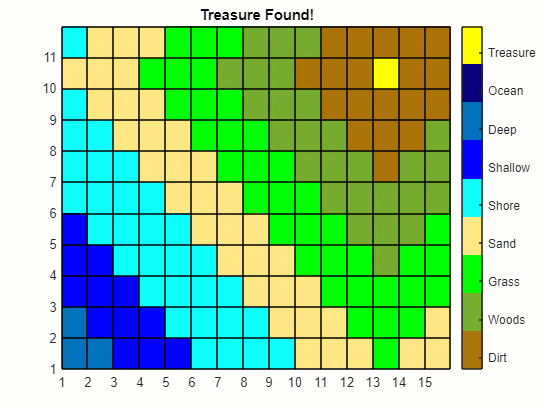 |
| [**Machine Learning Methods: Clustering**](https://www.mathworks.com/matlabcentral/fileexchange/135381-machine-learning-methods-clustering?s_tid=srchtitle)     | Get hands-on with the fundamentals of clustering in MATLAB. |  |
| [**Fundamentals of Programming**](https://www.mathworks.com/matlabcentral/fileexchange/103225-fundamentals-of-programming)       | Build a solid programming foundation with this guide. |  |
| [**Programming a Starter Project Using MATLAB and Python**](https://www.mathworks.com/matlabcentral/fileexchange/116490-programming-a-starter-project-using-matlab-and-python?s_tid=srchtitle)     | Begin your programming journey with MATLAB and Python. | 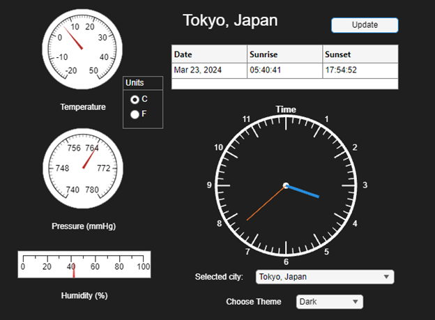 | 
| [**All Interactive Module Examples**](https://www.mathworks.com/matlabcentral/fileexchange/?term=tag:%22courseware+module%22) | A vast collection of interactive MATLAB examples. Ideal for watching and learning. | 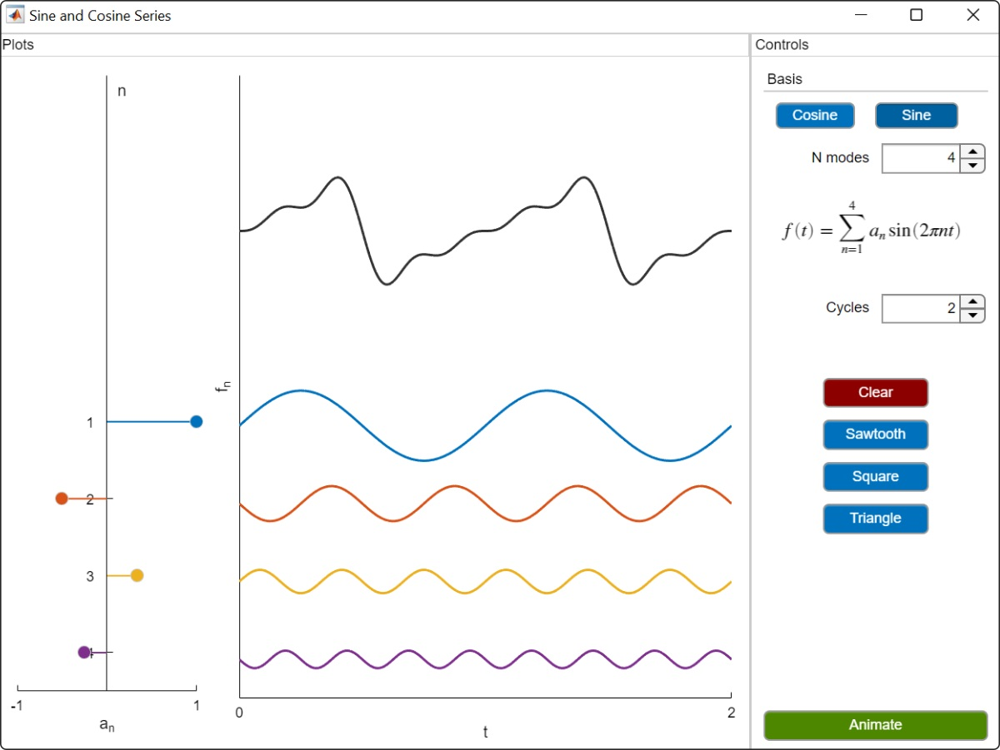 |

### 🎥 Fun MATLAB Animations

Take a break with these MATLAB animations and GIFs, perfect for a light-hearted diversion during your coding endeavors.

| Animation | Description |  |
|-----------|-------------|-------|
| [**Fun MATLAB Animation Code**](Fun%20Examples/MATLAB%20Animations) | Code compilation of engaging MATLAB animations. | 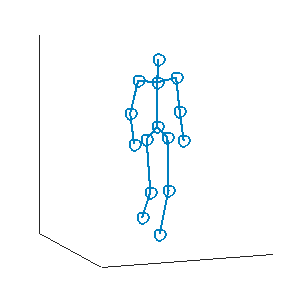 |
| [**MATLAB Gifs**](Fun%20Examples/MATLAB%20Animations/Gifs) | A showcase of MATLAB's graphical prowess through GIFs. Note, these are the outputs from the code folder above. |  |

---

## What's New in MATLAB and Simulink?

<table>
  <tr>
    <td>
      <a href="CheatSheets/R2025a-b-cheat-sheet-1.pdf">
        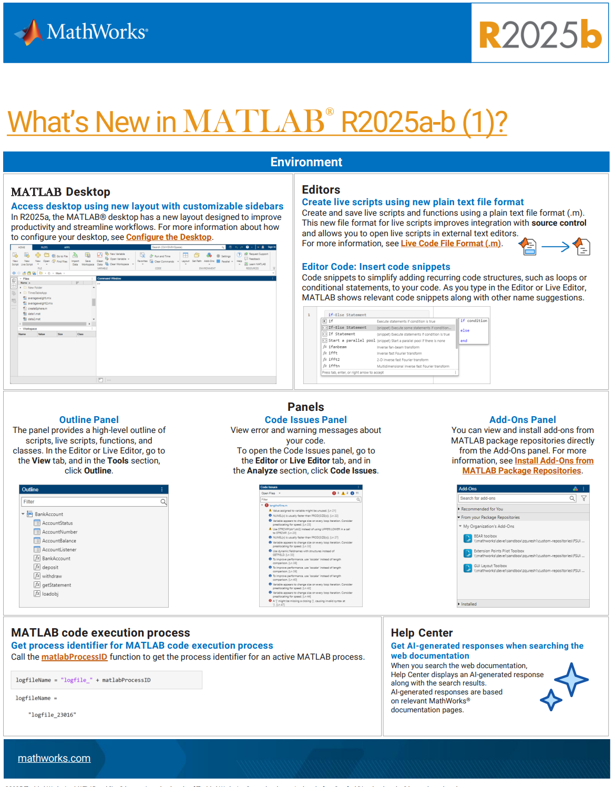
      </a>
    </td>
    <td>
      <a href="CheatSheets/R2025a-b-cheat-sheet-2.pdf">
        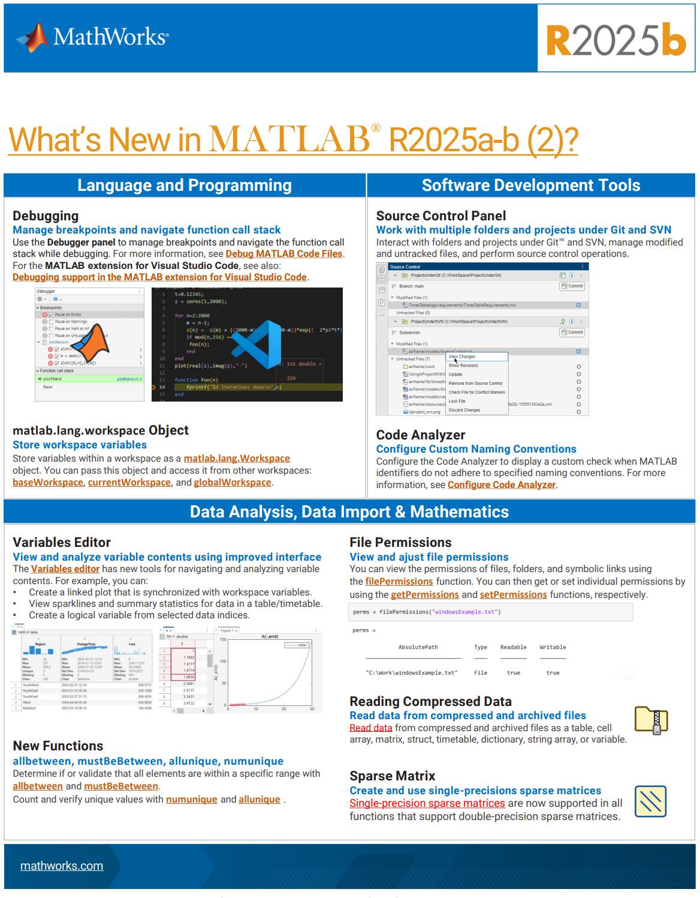
      </a>
    </td>
  </tr>
</table>

| New MATLAB Resource | Link |
|-------------|------|
| Check out new features and updates in the latest MATLAB Release | [Release Notes!](https://www.mathworks.com/products/new_products/latest_features.html) |
| Learn how to use Live Editor | [Live Editor](https://www.mathworks.com/products/matlab/live-editor.html) |
| MATLAB Kernel for Jupyter | [MATLAB + Jupyter](https://blogs.mathworks.com/matlab/2023/06/26/matlab-kernel-for-jupyter-now-with-windows-support/?fbclid=IwAR2Hjrm0Lou-hhu53d_cBKE8irWb7vtb7KnkELjMAQgRA1Yk-9ePHRZRJY0) |
| MATLAB Extension for Visual Studio Code | [MATLAB + Visual Studio Code](https://github.com/mathworks/matlab-extension-for-vscode) |

---

### How to use MATLAB with AI :robot:

<table>
  <tr>
    <td>
      <a href="CheatSheets/R2024a-ai-cheat-sheet.pdf">
        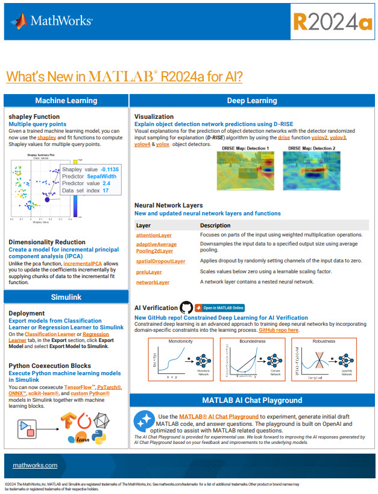
      </a>
    </td>
    <td>
      <a href="CheatSheets/R2024b-ai-cheat-sheet.pdf">
        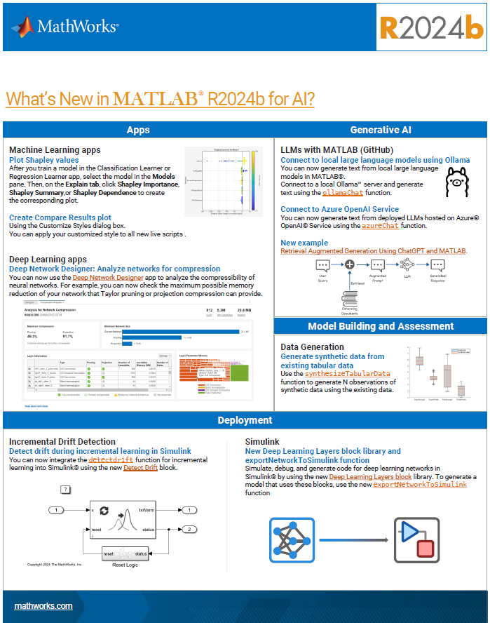
      </a>
    </td>
  </tr>
</table>

| Different ways to use generative AI with MATLAB | Link |
|-------------|------|
| **MATLAB Copilot**: MATLAB Copilot provides generative AI-powered capabilities specifically for the MATLAB desktop environment. It assists with MATLAB workflows and provides responses based on MATLAB-specific information. You can use MATLAB Copilot to learn techniques, develop ideas, and improve productivity. Note that you will need a Copilot license to use this product. | [MATLAB Copilot](https://www.mathworks.com/products/matlab-copilot.html) |
| **MATLAB GPT on OpenAI Store**: Access MATLAB GPT directly from the OpenAI Store to integrate advanced AI capabilities into your MATLAB workflows effortlessly. Note, you will need an account with OpenAI to use this tool. | [MATLAB GPT](https://chatgpt.com/g/g-QFTjbeK3U-matlab) |
| **MatGPT App**: Utilize the MatGPT app and class to seamlessly connect to the ChatGPT API from OpenAI™ within MATLAB®. This powerful tool allows you to leverage ChatGPT functionalities directly in your MATLAB environment. Note, you will need a MATLAB license to use this app. | [MatGPT App](https://www.mathworks.com/matlabcentral/fileexchange/126665-matgpt?s_tid=mlc_recom_leaf) |
| **MATLAB AI Chat Playground**: Explore the MATLAB AI Chat Playground on MathWorks.com to quickly experiment with AI, draft code, and solve problems interactively using AI-powered tools. Note, this is free to use but a MathWorks account is required. | [AI Chat Playground](https://www.mathworks.com/matlabcentral/playground/new) |
| **MATLAB MCP Core Server**: Integrate MATLAB into agentic AI workflows using the Model Context Protocol (MCP). MATLAB MCP Core Server standardizes connections between agentic AI apps (Claude Desktop®, Visual Studio Code®, Gemini CLI®) and MATLAB, enabling code execution, debugging, and automation. | [MATLAB MCP Core Server](https://www.mathworks.com/products/matlab-mcp-core-server.html) |
---
## Student Career Opportunities :briefcase:

**Join MathWorks and Explore Exciting Career Opportunities!**

**Internships and Recent Graduates:**

If you're interested in joining MathWorks, we have a range of exciting full-time and internship opportunities for students. Visit our [**students and recent graduates careers page**](https://www.mathworks.com/company/jobs/students.html?s_tid=cr_nav_ov) to explore the possibilities.

**On-Campus Job Opportunities: Become a MATLAB Student Ambassador!**

If you're currently enrolled as a student with over a year left before graduation, consider becoming a [**MATLAB Student Ambassador**](https://www.mathworks.com/academia/students/student-ambassadors.html) on your campus. Discover how you can make an impact and represent MathWorks within your academic community.
 

  

Discover inspiring stories of how students have leveraged MATLAB and Simulink to achieve success in their careers. Check out their stories [here!](https://blogs.mathworks.com/student-lounge/category/where-are-they-now/?s_tid=Blog_student-lounge_Category)

---
## Need a Student License of MATLAB?

**Discover if Your School Provides Access to MATLAB & Simulink!**

Curious to know if your school provides access to MATLAB & Simulink? Visit our [**Student License page**](https://www.mathworks.com/products/matlab/student.html) to find out! Alternatively, if that option doesn't work for you, we also provide an educationally priced MATLAB and Simulink Student Suite License. This license is specifically designed for students and offers a comprehensive set of tools at a discounted rate.

**🚀 Special Licensing for Student Startups, Accelerators, and Incubators**

If you're involved in a student startup, part of an accelerator, or incubator program, we have exciting news for you! We offer special licensing options for MATLAB and Simulink, tailored to meet the needs of emerging companies.

Learn more about how MATLAB and Simulink can support your startup's journey:

[**Explore MATLAB and Simulink for Startups**](https://www.mathworks.com/products/startups.html)

---
## Where to go to get help?

**Need Assistance? Get in Touch with Our Support Team!**

Students: Technical support from MathWorks is available for activation, installation and bug-related issues. For additional help visit our student resources above or contact your instructor.  [**Reach out to our dedicated support team**](https://www.mathworks.com/support/contact_us.html?s_tid=hc_trail).
