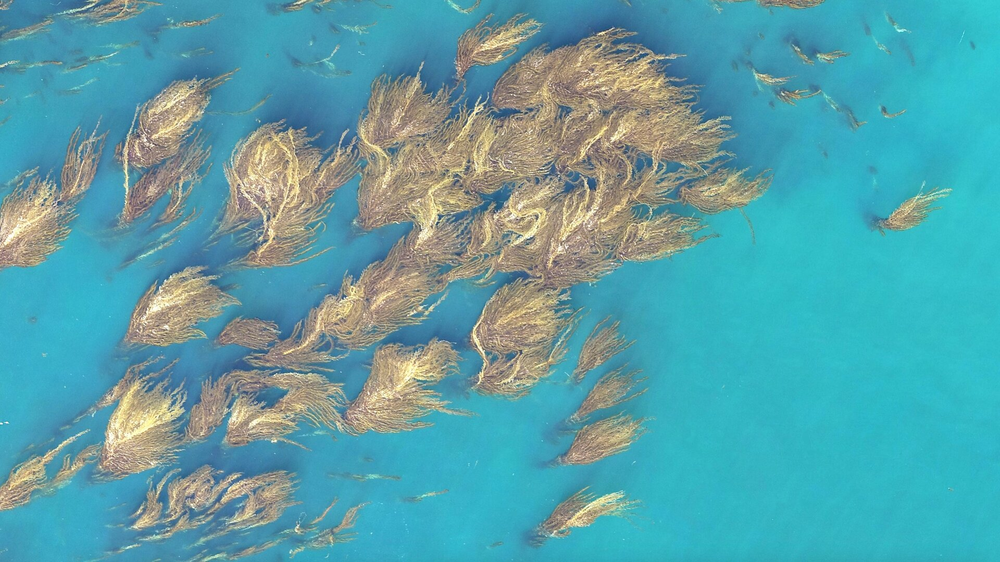

<td>

</td>

# MATLAB and Simulink for Students :school: :books: :computer:  

Are you a new MATLAB user seeking helpful tips and tricks? Are you a member of a student society in search of engaging workshops? Or perhaps you're looking for opportunities to test your MATLAB skills through student competitions or challenges? Look no further! Our awesome list repository below is a resource that caters to all these needs. Whether you're starting from scratch or aiming to enhance your existing knowledge, you'll find a wealth of information to help you learn MATLAB and make progress on your journey as a student. Explore the repository now and unlock the potential of MATLAB!

## Table of Contents

- [New to MATLAB? Start here!](#new-to-matlab-start-here-computer-bulb)
  - [Self-Paced Onramps](#self-paced-onramps)
  - [Cheat Sheets](#cheat-sheets-blue_book-pencil2)
- [Academic Discipline Specific Resources](#discipline-specific-resources-airplane-racing_car-robot-microscope)
- [Student Programs and Competitions](#student-programs-trophy)
  - [Hackathons and Capstone Projects](#related-matlab-github-resources-for-students)
  - [Student Societies and Clubs](#resources-for-student-societies-and-student-clubs)
- [What's New in MATLAB and Simulink](#whats-new-in-matlab-and-simulink)
- [Student Career Opportunities](#student-career-opportunities-briefcase)
- [Student License for MATLAB](#need-a-student-license-of-matlab)
- [Need Support or Help?](#where-to-go-to-get-help)

## New to MATLAB? Start here! :computer: :bulb:

Check out this section to explore what MATLAB is, how it is utilized in education and industry, and how it can benefit engineers and scientists globally.

<table>
<tbody>

<tr class="odd">
<td> <b>What is MATLAB and Simulink?<b>  
</td>
<td><ul>
Why is MATLAB important and how is it used? 
<li><a href="https://www.youtube.com/watch?v=joilU9m-sNk">MATLAB Overview</a></li>
<li><a href="https://www.youtube.com/watch?v=xkImXFzYDv4">MATLAB Basics: Back to School Edition </a></li>
<li><a href="https://www.mathworks.com/help/matlab/getting-started-with-matlab.html">Get Started with MATLAB Documentation</a></li>
<li><a href="https://www.mathworks.com/company/user_stories/designed-with-matlab.html">How will you use MATLAB?</a></li>
 
What is Simulink? 
<li><a href="https://www.youtube.com/watch?v=GvRugdEICyQ">Simulink Overview</a></li>
<li><a href="https://www.mathworks.com/help/simulink/getting-started-with-simulink.html">Get Started with Simulink Documentation</a></li>
 
<a href="https://www.mathworks.com/help/?s_tid=gn_supp">Full MATLAB & Simulink Documentation</a>
 
 
Check to see if your school has a campus wide-license:
<li><a href="https://www.mathworks.com/products/matlab/student.html">Get MATLAB</a></li>

<tr class="odd">
<td> <b>Getting Started Onramps<b>  

 </td>
<td><ul>
Primary or Secondary School students start here:
<li><a href="https://learntocode.mathworks.com/">Learn to Code</a></li>
 
University and College Students Start here:
 
Complimentary 2-hour MATLAB tutorials for 
<li><a href="https://matlabacademy.mathworks.com/details/matlab-onramp/gettingstarted">MATLAB</a></li>
<li><a href="https://matlabacademy.mathworks.com/details/machine-learning-onramp/machinelearning">Machine Learning</a></li>
<li><a href="https://matlabacademy.mathworks.com/details/deep-learning-onramp/deeplearning">Deep Learning</a></li>
<li><a href="https://matlabacademy.mathworks.com/details/reinforcement-learning-onramp/reinforcementlearning">Reinforcement Learning</a></li>
<li><a href="https://matlabacademy.mathworks.com/details/optimization-onramp/optim">Optimization</a></li>
<li><a href="https://matlabacademy.mathworks.com/details/signal-processing-onramp/signalprocessing">Signal Processing</a></li>
<li><a href="https://matlabacademy.mathworks.com/details/image-processing-onramp/imageprocessing">Image Processing</a></li>
 
Complimentary 2-hour Simulink tutorials for
<li><a href="https://matlabacademy.mathworks.com/details/simulink-onramp/simulink">Simulink</a></li>
<li><a href="https://matlabacademy.mathworks.com/details/stateflow-onramp/stateflow">Stateflow</a></li>
<li><a href="https://matlabacademy.mathworks.com/details/control-design-onramp-with-simulink/controls">Control Design</a></li>
<li><a href="https://matlabacademy.mathworks.com/details/simscape-onramp/simscape">Simscape</a></li>
<li><a href="https://matlabacademy.mathworks.com/details/circuit-simulation-onramp/circuits">Circuit Simulation</a></li>
</ul></td>
</tr>

<tr class="odd">
<td> <b>MATLAB Cheat Sheets<b>  

<td><ul>

Check out our Cheat Sheet Repository to help you learn the following topics
- [MATLAB Basic Functions](https://github.com/mathworks/awesome-matlab-students/blob/main/CheatSheets/matlab-basic-functions-reference.pdf) 
- [Visualization](https://github.com/mathworks/awesome-matlab-students/blob/main/CheatSheets/MATLAB_Visualization_Reference_EN.pdf)
- [Importing data](https://github.com/mathworks/awesome-matlab-students/blob/main/CheatSheets/importing-exporting-data-cheat-sheet.pdf)
- [Deep Learning](https://github.com/mathworks/awesome-matlab-students/blob/main/CheatSheets/deep-learning-with-matlab-quick-start-guide.pdf)
- [Using MATLAB with Python](https://github.com/mathworks/awesome-matlab-students/blob/main/CheatSheets/using-matlab-with-python-cheat-sheet.pdf)
- [Machine Learning](https://github.com/mathworks/awesome-matlab-students/blob/main/CheatSheets/machine-learning-quick-start-guide.pdf)
- [MATLAB for Python Users](https://github.com/mathworks/awesome-matlab-students/blob/main/CheatSheets/matlab-for-python-users-cheat-sheet.pdf)
- [Live Editor](https://github.com/mathworks/awesome-matlab-students/blob/main/CheatSheets/live-editor-quick-start-guide.pdf)
- and more!
 

[All Cheat Sheets](https://github.com/mathworks/awesome-matlab-students/tree/main/CheatSheets)
  
</ul></td>

<tr class="odd">
<td> <b>MATLAB's YouTube How-To Playlist<b>  
</td>
<td><ul>
Short videos from MathWorks’ engineers on how to solve some of the most common tasks for your project
<li><a href="https://www.youtube.com/playlist?list=PLn8PRpmsu08oBSjfGe8WIMN-2_rwWFSgr">Watch the Videos</a></li>
</ul></td>
</tr>

<tr class="odd">
<td> <b> MATLAB and Simulink examples for Students</a></b>
 </td>
<td><ul>
Learn How to Use MATLAB and Simulink
<li><a href="https://www.mathworks.com/academia/examples.html?s_tid=ln_acad_learn_examples">MATLAB and Simulink examples</a></li>
<li><a href="https://www.mathworks.com/support/learn-with-matlab-tutorials.html?s_tid=ln_acad_learn_tutorials">MATLAB and Simulink Tutorials</a></li>
<li><a href="https://www.mathworks.com/matlabcentral/cody/?s_tid=ln_acad_learn_cody">Practice Coding with Cody</a></li>
</ul></td>
</tr>
 
<tr class="odd">
<td> <b>Student Lounge Blog<b>  
</td>
<td><ul>
Sharing technical and real-life examples of how students can use MATLAB and Simulink in their everyday projects #studentsuccess
<li><a href="https://blogs.mathworks.com/student-lounge/category/data-science/?s_tid=Blog_student-lounge_Category">Data Science</a></li>
<li><a href="https://blogs.mathworks.com/student-lounge/category/workflow/?s_tid=Blog_student-lounge_Category">Project Workflows</a></li>
<li><a href="https://blogs.mathworks.com/student-lounge/category/skills/?s_tid=Blog_student-lounge_Category">Improve your skills</a></li>
<li><a href="https://blogs.mathworks.com/student-lounge/category/automated-driving/?s_tid=Blog_student-lounge_Category">Automated Driving</a></li>
<li><a href="https://blogs.mathworks.com/student-lounge/">All Student Lounge Blogs</a></li>
</ul></td>
</tr>

<tr class="odd">
<td> <b>MATLAB Central's File Exchange<b>  
  
</td>
<td><ul>
Download and use community-contributed code to help you get started or gain inspiration for your project
<li><a href="https://www.mathworks.com/matlabcentral/fileexchange/?s_tid=gn_mlc_fx_files">Find Code to inspire your project</a></li>
<li><a href="https://www.mathworks.com/matlabcentral/fileexchange/?category%5B%5D=support%2Fgaming800">Need a Study Break? Download a game on File Exchange</a></li>
<ul>
<li>Matt Fig (2023). MATLABTETRIS ([https://www.mathworks.com/matlabcentral/fileexchange/34513-matlabtetris](https://www.mathworks.com/matlabcentral/fileexchange/34513-matlabtetris)), MATLAB Central File Exchange. Retrieved July 20, 2023.</li>     
</ul>
</ul></td>
</tr>

<tr class="odd">
<td> <b>MATLAB Answers<b>  

<td><ul>
Find Answers, Learn, and Share Your Knowledge
<li><a href="https://www.mathworks.com/matlabcentral/answers/index/?s_tid=gn_mlc_an">Learn from the Community</a></li>
</ul></td>
</tr>

</tr>
<tr class="odd">
<td> <b> Videos and Tutorials for Student Projects <b>  

<td><ul>
Learn How to Use MATLAB and Simulink for Student Projects
<li><a href="https://www.mathworks.com/videos/series/robotics-education.html">Robotics</a>, <a href="https://www.mathworks.com/videos/series/perception.html">Perception</a>, <a href="https://www.mathworks.com/videos/series/implementation.html">Implementation</a></li>
<li><a href="https://www.mathworks.com/videos/series/student-competition-code-generation-training.html">Code generation and working with Hardware</a></li>
<li><a href="https://www.mathworks.com/videos/series/making-vehicles-and-robots-see-getting-started-with-perception-for-students.html">Making Vehicles and Robots See</a></li>
<li><a href="https://www.mathworks.com/videos/series/hybrid-electric-vehicles.html">Hybrid Electric Vehicles</a></li>
<li><a href="https://www.mathworks.com/videos/series/aerospace.html">Aerospace</a></li>
<li><a href="https://www.mathworks.com/videos/series/improving-your-racecar-development-101027.html">Automotive System Development</a></li>
<li><a href="https://www.mathworks.com/academia/student-competitions/tutorials-videos.html?s_tid=ln_acad_programs_tutorials">All Student Project Tutorials</a></li>
</ul></td>
</tr>

<tr class="odd">
<td> <b> Try MATLAB Online or MATLAB Mobile <b>  

<td><ul>

<li><a href="https://www.mathworks.com/products/matlab-mobile.html">Access MATLAB on the go! </a> Learn how to collect data and use MATLAB right from your smartphone </li>
<li><a href="https://www.mathworks.com/products/matlab-online.html">Access MATLAB on the web, no download required </a></li>

</ul></td>
</tr>

<tr class="odd">
<td> <b> Connect to Hardware using MATLAB <b>  

<td><ul>

<li><a href="https://www.mathworks.com/hardware-support/home.html">All Hardware Support</a></li>
<li><a href="https://www.mathworks.com/hardware-support/arduino-matlab.html?s_tid=srchtitle">Arduino® Support</a></li>
<li><a href="https://www.mathworks.com/hardware-support/raspberry-pi-matlab.html?s_tid=srchtitle">Raspberry Pi™ Support</a></li>
<li><a href="https://www.youtube.com/watch?v=IwIF_2tFnVo">Use Devices with Hardware Manager</a></li>

</ul></td>
</tr>

<tr class="odd">
<td> <b> Join our MATLAB Communities and follow us on Social Media <b>  

<td><ul>
Ask questions, learn from others, and get ideas by joining our communities below!
<li><a href="https://www.mathworks.com/matlabcentral/">MATLAB Central</a></li>
<li><a href="https://discord.com/invite/TsDarpu">Discord</a></li>
<li><a href="https://www.reddit.com/r/matlab/">Reddit</a></li>
<li><a href="https://www.instagram.com/matlab/">Instagram</a></li>
<li><a href="https://www.facebook.com/MATLAB">Facebook</a></li>

</ul></td>

</tr>

<tr class="odd">
<td> <b> Tune in to a Live Event or Webinar <b>  

<td><ul>

<li><a href="https://www.mathworks.com/company/events/search.html?s_tid=gn_ev_uw&q=&page=1">MATLAB and Simulink Live Events
 </a> </li>
<li><a href="https://www.mathworks.com/videos/search.html?s_tid=gn_ev_rw&q=&page=1">On-Demand Videos and Webinars</a></li>

</ul></td>
</tr>

<tr class="odd">
<td> <b>MATLAB and Simulink Books<b>  

<td><ul>
More than 2,000 titles available for Students! 
<li><a href="https://www.mathworks.com/academia/books.html?s_tid=ln_acad_learn_books">Explore our book list</a></li>
</ul></td>
</tr>

<tr class="odd">
<td> <b>Student Announcement: Kelp Wanted! Segmenting Kelp Forests <b>  

<td><ul>
Looking for an opportunity to practice your AI skills on a real-world problem? Interested in AI for Climate Change? Sign up for the Kelp Wanted challenge, which tasks participants with developing an algorithm that can detect the presence of kelp forests from satellite images! Participants of all skill levels are welcome, and MathWorks provides starter code and complimentary MATLAB licenses for all participants to help them get started.
<li><a href="https://www.drivendata.org/competitions/255/kelp-forest-segmentation/">Join the competition!</a></li>
</ul></td>
</tr>

<tr class="odd">
<td> <b> MATLAB AI Chat Playground <b>  

<td><ul>
Discover the future of coding with the MATLAB AI Chat Playground! Dive into Generative AI to swiftly draft code, solve intricate problems, and accelerate your MATLAB projects like never before. 
<li><a href="https://www.mathworks.com/matlabcentral/playground">The MATLAB AI Chat Playground is ready for you to experiment with Generative AI, answer questions, and write initial draft MATLAB® code. </a></li>
</ul></td>
</tr>

</tbody>
</table>

## Self-Paced Onramps
**Discover and Elevate Your Skills with MATLAB and Simulink Onramps**

[MATLAB and Simulink Onramps](https://matlabacademy.mathworks.com/?s_tid=ln_acad_learn_oc#getting-started) offer a remarkable opportunity to explore a wide range of topics according to your interests and preferred pace. These onramps are designed to be flexible, allowing you to complete them at your convenience while effectively guiding you through various learning objectives. By immersing yourself in these onramps, you can unlock the power of MATLAB and Simulink, elevating your engineering and science skills to new heights.

| Machine Learning Onramp | Deep Learning Onramp | Circuit Simulation Onramp | Reinforcement Learning Onramp |
|-------------------------|---------------------|--------------------------|------------------------------|
|  |  |  |  |

| Image Processing Onramp | Computer Vision Onramp | Signal Processing Onramp | Simscape Onramp |
|------------------------|-----------------------|-------------------------|-----------------|
|  |  |  |  |

| Stateflow Onramp | Control Design Onramp with Simulink | Optimization Onramp | App Building Onramp |
|------------------|-------------------------------------|---------------------|---------------------|
|  |  |  |  |

| MATLAB Onramp | Simulink Onramp |
|---------------|-----------------|
|  |  |

## Cheat Sheets :blue_book: :pencil2:

​​**Master MATLAB Functions and Commands with Featured Cheat Sheets**

Explore this section to find a collection of featured cheat sheets that provide concise references for learning MATLAB functions and commands. Whether you're a beginner or an experienced user, these cheat sheets offer valuable insights and quick reminders to enhance your MATLAB proficiency. To access our complete library of cheat sheets, visit: [Cheat Sheets](CheatSheets)

***Quick Tip! [Use Keyboard Shortcuts to Navigate MATLAB](https://www.mathworks.com/help/matlab/matlab_env/accessibility-use-keyboard-shortcuts-to-navigate-matlab.html)***

<table>
<tbody>

<tr class="odd">
<td> <b>MATLAB Basic Functions Cheat Sheet<b>  
</td>
<td><ul>
  
[MATLAB Basic Functions Cheat Sheet](CheatSheets/matlab-basic-functions-reference.pdf)
  
</ul></td>
</tr>

<tr class="odd">
<td> <b>Using MATLAB with Python Cheat Sheet<b>  
</td>
<td><ul>
  
[Using MATLAB with Python Cheat Sheet](CheatSheets/using-matlab-with-python-cheat-sheet.pdf)
 
 
[MATLAB for Python Users](CheatSheets/matlab-for-python-users-cheat-sheet.pdf)
 
 
[Using Simulink with Python](https://www.mathworks.com/help/simulink/python-code-integration.html)
</ul></td>
</tr>

<tr class="odd">
<td> <b> Machine Learning with MATLAB Cheat Sheet<b>  
</td>
<td><ul>
  
[Machine Learning with MATLAB](CheatSheets/machine-learning-quick-start-guide.pdf)

</ul></td>
</tr>

<tr class="odd">
<td> <b> MATLAB Visualization Cheat Sheet<b>  
</td>
<td><ul>
  
[MATLAB Visualization Cheat Sheet](CheatSheets/MATLAB_Visualization_Reference_EN.pdf) 
 
 
[Check out the MATLAB Plot Gallery for more examples](https://www.mathworks.com/products/matlab/plot-gallery.html)
</ul></td>
</tr>

<tr class="odd">
<td> <b> Modeling Dynamic Systems with MATLAB and Simulink Cheat Sheet <b>  
</td>
<td><ul>
  
[Modeling Dynamic Systems Cheat Sheet](CheatSheets/modeling-dynamic-systems-cheat-sheet.png) 
 
 
[Explore more capabilities for modeling dynamic systems here](https://www.mathworks.com/solutions/control-systems/modeling-dynamic-systems.html?s_eid=PSM_17435)

</ul></td>
</tr>

</tbody>
</table>

## Discipline-Specific Resources :airplane: :racing_car: :robot: :microscope:

**Explore Additional Resources for Your Academic Discipline**

Click on the icon in the table below to access a wealth of additional resources tailored to your academic discipline. See how MATLAB & Simulink are used in Industry by reading one of our [customer stories](https://www.mathworks.com/company/customer-stories.html).

| Aerospace & Defense | Utilities & Energy | Artificial Intelligence | Automotive | Physics | Robotics |
|:---:|:---:|:---:|:---:|:---:|:---:|
|  |  |  |  |  |  |

| Biological Sciences | Finance & Risk Management | Communications | Medical Devices | Chemistry | Electronics | Earth, Ocean & Atmospheric Sciences |
|:---:|:---:|:---:|:---:|:---:|:---:|:---:|
|  |  |  |  |  |  |  |

#### Additional Resources:
- [MATLAB and Simulink Webinars/Videos](https://www.mathworks.com/videos.html)
- [Discipline or Industry Specific Resources](https://www.mathworks.com/solutions.html?s_tid=gn_sol)
- [Product-Specific Support](https://www.mathworks.com/help/?s_tid=gn_supp)
- Additional Online Courses with [edX](https://www.edx.org/school/mathworks) and [COURSERA!](https://www.coursera.org/mathworks)
- [Industry User Stories](https://www.mathworks.com/company/user_stories/search.html?q=&page=1)
- [External Language Interfaces](https://www.mathworks.com/help/matlab/external-language-interfaces.html)
  

## Student Programs :trophy:
**Explore Exciting Student Competitions, Hackathons, and Minidrone Contests!**

Unleash your creativity and passion by discovering a world of student competitions, hackathons, mini drone contests, and more! This is your chance to showcase your skills, collaborate with like-minded individuals, and tackle real-world challenges. Don't miss out on the thrilling opportunities that await you! Explore them all [right here!](https://www.mathworks.com/academia/students.html?s_tid=ln_acad_programs_overview)

  <kbd>
    
  </kbd>

## Related MATLAB GitHub Resources for Students 

**MATLAB and Simulink Challenge Projects: Contribute to the progress of engineering and science by solving key industry challenges!**

Are you in search of a design or research project idea that has real industry relevance and can make a positive societal impact? Look no further!

[Explore this GitHub list](https://github.com/mathworks/MathWorks-Excellence-in-Innovation) of challenge projects to stay up-to-date with technology trends, gain practical skills using MATLAB and Simulink, and contribute to the fields of science and engineering. By participating, you'll enhance your problem-solving abilities and receive official recognition for your accomplishments from technology leaders at MathWorks. Plus, there are rewards waiting for you upon project completion!

**Awesome MATLAB Hackathons: Participate in an upcoming Hackathon!**

If you're interested in joining one of our sponsored Hackathons, we have something for you too! [Check out our Student Hackathons GitHub repository](https://github.com/mathworks/awesome-matlab-hackathons) to learn more about these exciting events and the opportunity to win fantastic prizes!

**Awesome MATLAB and Simulink Robotics**

A list of awesome demos, tutorials, utilities, and overall resources for the robotics community that use MATLAB® and Simulink®: [Awesome MATLAB Robotics](https://github.com/mathworks-robotics/awesome-matlab-robotics)

## Resources for Student Societies and Student Clubs

**Host an Engaging MATLAB or Simulink Workshop for Your Student Society or Club!**

If you're part of a student society or club and want to organize an exciting MATLAB or Simulink workshop, we've got you covered! Discover how you can host a captivating MATLAB Onramp Party or a thrilling Cody competition using the valuable resources provided below. 

Please note that while MathWorks cannot offer financial support or prizes for these events, we're here to assist you in creating an unforgettable learning experience for your participants. 

| **MATLAB Onramp Party Resources** | **Cody Competition Resources** |
| :---: | :---: |
| 

 - [Onramp Toolkit](https://github.com/mathworks/awesome-matlab-students/tree/main/Student%20Societies%20and%20Clubs/Onramp%20Toolkit) - [How to host an Onramp Party Guide](https://github.com/mathworks/awesome-matlab-students/blob/main/Student%20Societies%20and%20Clubs/Onramp%20Toolkit/1_How_to_Run_an_Onramp_Party.docx) - [Example Presentations](https://github.com/mathworks/awesome-matlab-students/tree/main/Student%20Societies%20and%20Clubs/Onramp%20Toolkit/Example%20Presentations) | 

 - [Cody Competition Toolkit](https://github.com/mathworks/awesome-matlab-students/tree/70cd61430cbcc0b3de12257c12f5bbd0450c6e5c/Student%20Societies%20and%20Clubs/Cody%20Competition)

## What's New in MATLAB and Simulink?

- Check out new features and updates in the latest MATLAB Release [here!](https://www.mathworks.com/products/new_products/latest_features.html)
- Check out the MATLAB Expo 2023 featured presentations [here!](https://www.matlabexpo.com/online/2023/proceedings.html)
- Learn how to use [Live Editor](https://www.mathworks.com/products/matlab/live-editor.html)
- [MATLAB Kernel for Jupyter](https://blogs.mathworks.com/matlab/2023/06/26/matlab-kernel-for-jupyter-now-with-windows-support/?fbclid=IwAR2Hjrm0Lou-hhu53d_cBKE8irWb7vtb7KnkELjMAQgRA1Yk-9ePHRZRJY0)
- [Try MatGPT!](https://www.mathworks.com/matlabcentral/fileexchange/126665-matgpt?s_tid=mlc_recom_leaf) MATLAB® app and class to access ChatGPT API from OpenAI™.
- [MATLAB AI Chat Playground is now available](https://www.mathworks.com/matlabcentral/playground/new)

## Student Career Opportunities :briefcase:

**Join MathWorks and Explore Exciting Career Opportunities!**

**Internships and Recent Graduates:**

If you're interested in joining MathWorks, we have a range of exciting full-time and internship opportunities for students. Visit our [students and recent graduates careers page](https://www.mathworks.com/company/jobs/students.html?s_tid=cr_nav_ov) to explore the possibilities.

**On-Campus Job Opportunities: Become a MATLAB Student Ambassador!**

Additionally, if you're currently enrolled as a student with over a year left before graduation, consider becoming a [MATLAB Student Ambassador](https://www.mathworks.com/academia/students/student-ambassadors.html) on your campus. Discover how you can make an impact and represent MathWorks within your academic community.

Discover inspiring stories of how students have leveraged MATLAB and Simulink to achieve success in their careers. Check out their stories [here!](https://blogs.mathworks.com/student-lounge/category/where-are-they-now/?s_tid=Blog_student-lounge_Category)

## Need a Student License of MATLAB?

**Discover if Your School Provides Access to MATLAB & Simulink!**

Curious to know if your school provides access to MATLAB & Simulink? Visit our [Student License page](https://www.mathworks.com/products/matlab/student.html) to find out! Alternatively, if that option doesn't work for you, we also provide an educationally priced MATLAB and Simulink Student Suite License. This license is specifically designed for students and offers a comprehensive set of tools at a discounted rate.

## Where to go to get help?

**Need Assistance? Get in Touch with Our Support Team!**

Students: Technical support from MathWorks is available for activation, installation and bug-related issues. For additional help visit our student resources above or contact your instructor.  [Reach out to our dedicated support team](https://www.mathworks.com/support/contact_us.html?s_tid=hc_trail).
